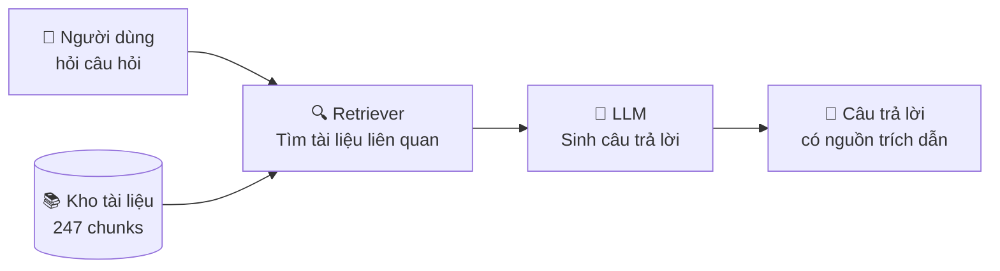
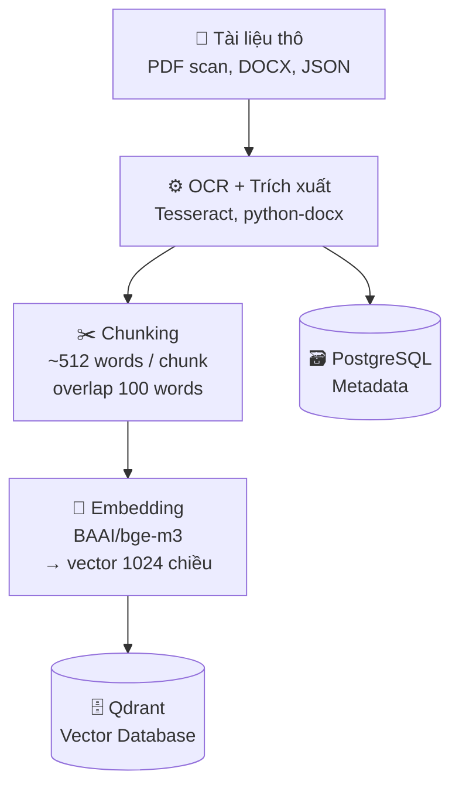
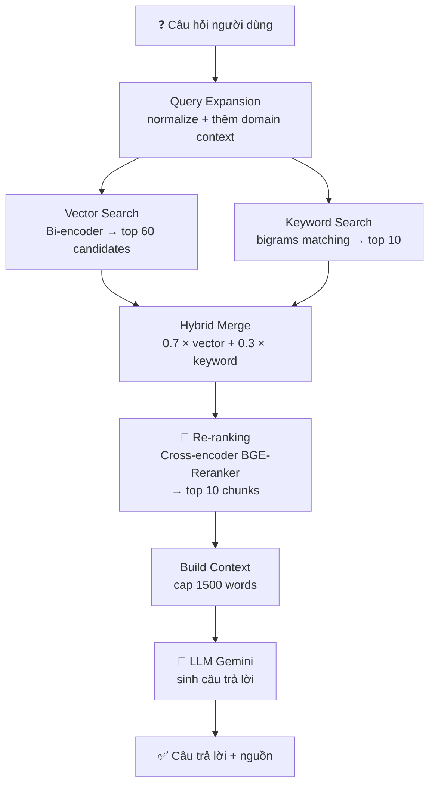
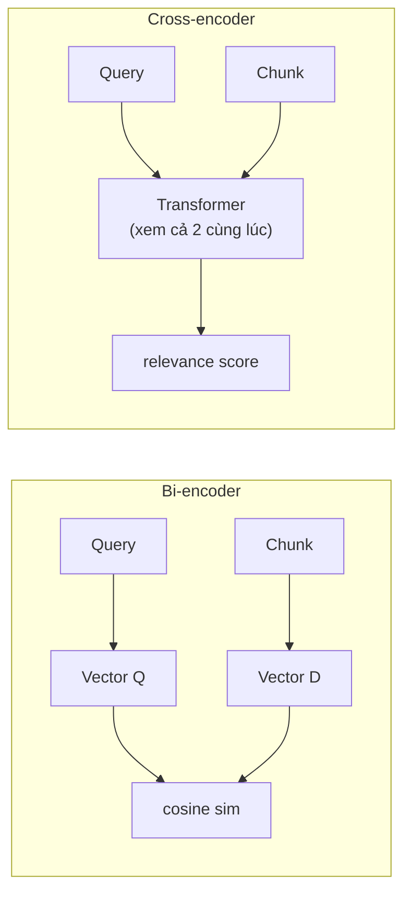

# Kiến Trúc RAG Embedding và Reranking — Chatbot UIT

---

## Slide 1: Vấn đề cần giải quyết

### Chatbot cần trả lời câu hỏi từ tài liệu nội bộ

- Hàng trăm trang văn bản pháp quy, quy chế, FAQ
- LLM không biết thông tin nội bộ của UIT
- Không thể đưa toàn bộ tài liệu vào mỗi câu hỏi (quá dài, tốn tiền)

### Giải pháp: RAG — Retrieval-Augmented Generation

> **Tìm đúng đoạn văn liên quan → đưa vào LLM → sinh câu trả lời**

---

## Slide 2: Tổng quan kiến trúc RAG



- **Retriever** = Hệ thống tìm kiếm thông minh
- **LLM** = Gemini — đọc tài liệu và trả lời
- **Chunks** = Tài liệu đã được cắt nhỏ, mã hoá thành vector

---

## Slide 3: Giai đoạn 1 — Xây dựng kho dữ liệu (Offline)



| Bước | Công cụ | Output |
|------|---------|--------|
| OCR | Tesseract + OpenCV | Text từ PDF scan |
| Chunking | Python | 247 chunks |
| Embedding | BGE-M3 | Vector 1024 chiều |
| Lưu trữ | Qdrant + PostgreSQL | Index tìm kiếm |

---

## Slide 4: Embedding là gì?

### Biến văn bản thành con số để so sánh

```
"Học phí hệ từ xa bao nhiêu?"
        ↓  BGE-M3
[0.12, -0.87, 0.43, ..., 0.91]  ← vector 1024 chiều

"Mức học phí chương trình đào tạo từ xa UIT là..."
        ↓  BGE-M3
[0.11, -0.85, 0.44, ..., 0.89]  ← vector gần giống nhau!
```

- Câu hỏi và câu trả lời **không cần dùng cùng từ**
- Mô hình hiểu **ngữ nghĩa** — "học phí" ≈ "mức phí" ≈ "chi phí học"
- Đo độ tương đồng bằng **cosine similarity**

---

## Slide 5: Giai đoạn 2 — Trả lời câu hỏi (Online)



---

## Slide 6: Hybrid Search — Tại sao kết hợp 2 phương pháp?

### Vector Search (Semantic)
- Tìm theo **ngữ nghĩa** — hiểu ý nghĩa câu hỏi
- Tốt với câu hỏi tự nhiên, paraphrase
- Yếu với **số cụ thể, mã văn bản** (VD: "Thông tư 28/2023")

### Keyword Search (Exact Match)
- Tìm theo **từ khoá chính xác**
- Bắt được mã số, tên riêng, thuật ngữ pháp lý
- Yếu với câu hỏi ngữ nghĩa phức tạp

### Hybrid = Tốt nhất của cả hai

```
final_score = vector_score × 0.7 + keyword_score × 0.3
```

---

## Slide 7: Re-ranking — Tại sao cần thêm bước này?

### Vấn đề với Bi-encoder (Embedding)

```
Query:  "Điều kiện tốt nghiệp hệ từ xa"
Chunk A: "...điều kiện xét tốt nghiệp bao gồm..."  ← Đúng
Chunk B: "...hệ đào tạo từ xa UIT tuyển sinh..."   ← Ít liên quan hơn
```

> Bi-encoder encode **độc lập** → không thấy được tương tác chi tiết giữa query và chunk

### Cross-encoder (Re-ranker) xử lý cặp (query, chunk) **cùng lúc**



---

## Slide 8: So sánh Bi-encoder vs Cross-encoder

| Tiêu chí | Bi-encoder (BGE-M3) | Cross-encoder (BGE-Reranker) |
|----------|---------------------|------------------------------|
| Cách encode | Query và Doc riêng lẻ | Cặp (Query, Doc) cùng nhau |
| Tốc độ | ⚡ Rất nhanh (index offline) | 🐢 Chậm hơn (inference per pair) |
| Độ chính xác | Approximate | Chính xác cao |
| Dùng cho | Lọc 247 chunks → top 60 | Rerank top 60 → top 10 |
| Model | BAAI/bge-m3 | BAAI/bge-reranker-v2-m3 |

> **Chiến lược:** Bi-encoder làm "lọc thô" nhanh → Cross-encoder làm "lọc tinh" chính xác

---

## Slide 9: Toàn bộ pipeline — số liệu thực

```
247 chunks trong Qdrant
        │
        ▼
   Vector Search → 60 candidates  (k=10, pull=k×6)
   Keyword Search → 10 candidates
        │
        ▼
   Hybrid Merge + filter score ≥ 0.175
        │
        ▼
   Cross-encoder rerank → top 10 chunks
        │
        ▼
   Build context ≤ 1500 words
        │
        ▼
   Gemini LLM → câu trả lời
```

---

## Slide 10: Kho dữ liệu — Tài liệu được xử lý

| Loại tài liệu | Số file | Số chunks |
|---------------|---------|-----------|
| PDF scan (OCR Tesseract) | 8 file | 163 chunks |
| DOCX (FAQ, tuyển sinh, CTĐT) | 5 file | 60 chunks |
| JSON (scraper CITD) | 2 file | 24 chunks |
| **Tổng** | **15 nguồn** | **247 chunks** |

### Nguồn tài liệu chính
- Thông tư 28/2023/TT-BGDĐT — Quy chế đào tạo từ xa
- Quy chế đào tạo UIT (507, 790, 1499-QĐ)
- Chương trình đào tạo CNTT, AI
- Câu hỏi thường gặp, hồ sơ tuyển sinh
- Dữ liệu scrape từ website CITD

---

## Slide 11: Tóm tắt — Điểm mạnh kiến trúc

### ✅ Ưu điểm

- **Hai tầng tìm kiếm** — kết hợp semantic + exact match
- **Re-ranking chính xác** — cross-encoder hiểu ngữ cảnh sâu hơn
- **Hoàn toàn offline** — embedding và reranker chạy local, không cần API
- **Metadata phong phú** — mỗi chunk biết nguồn, loại văn bản, cơ quan ban hành
- **Query expansion** — tự động chuẩn hoá câu hỏi ngắn/tắt

### ⚠️ Hướng cải thiện tiếp theo

- Tăng `max_length` cross-encoder từ 512 → 1024 tokens
- Giảm candidates từ 60 → 30 (tối ưu latency)
- Cải thiện OCR cho trang scan mờ/nghiêng
