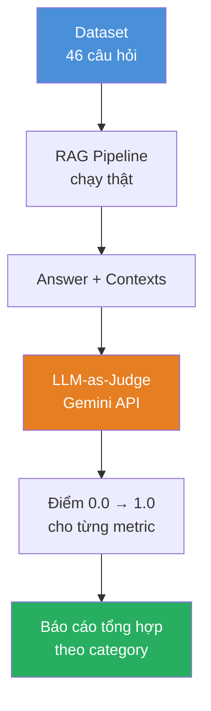
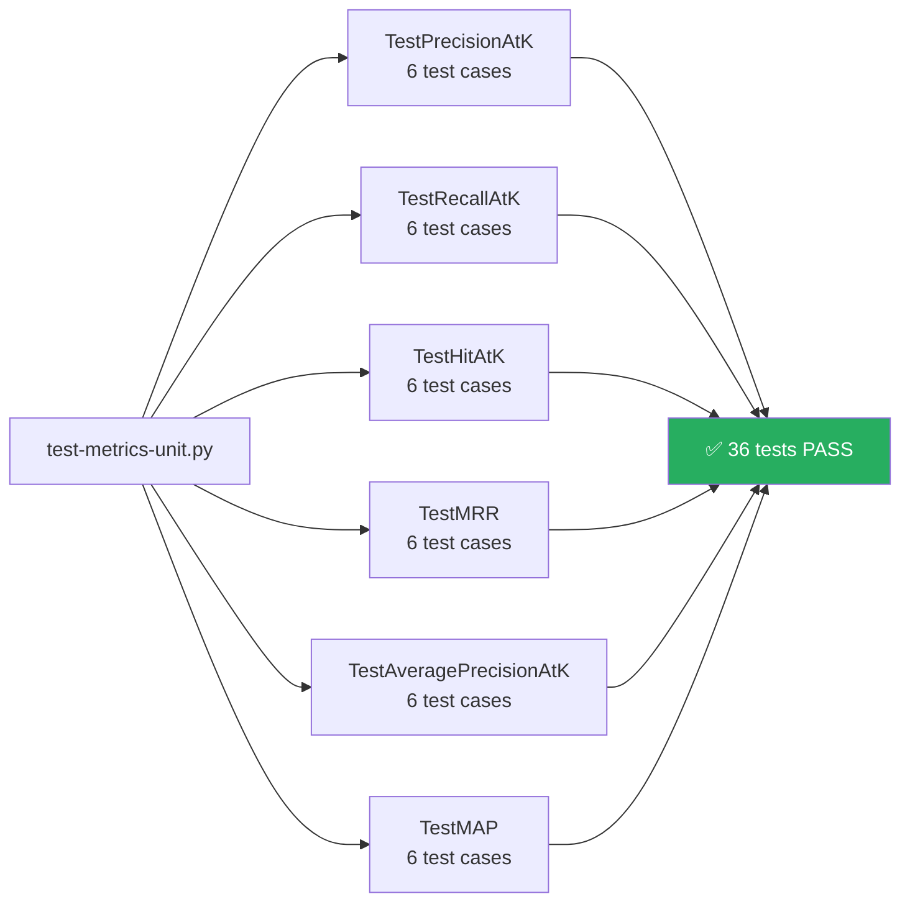
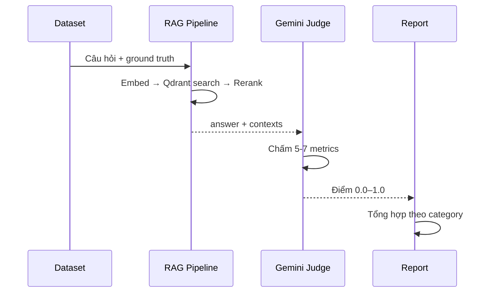
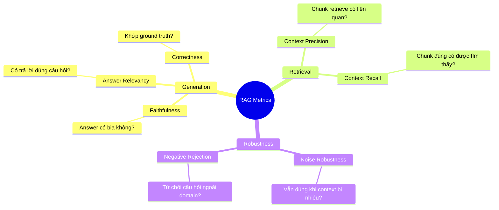
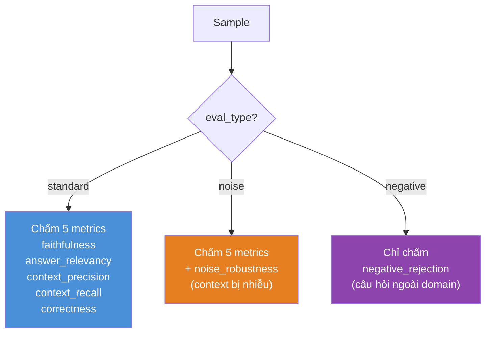

# Phương Pháp Đánh Giá RAG Chatbot UIT theo Auepora Framework

---
## Slide 1: Giới Thiệu

**Mục tiêu:** Đánh giá toàn diện chất lượng hệ thống RAG Chatbot tư vấn đào tạo UIT

**Dựa trên:** Auepora Framework (paper 2405.07437) — bộ tiêu chí đánh giá RAG có hệ thống

**2 tầng kiểm thử:**
- **Tầng 1:** Unit Tests — kiểm tra thuần toán học, không cần LLM
- **Tầng 2:** RAG Evaluation — LLM-as-Judge với dữ liệu thật

---
## Slide 2: Kiến Trúc Tổng Quan



---
## Slide 3: Dataset — Dữ Liệu Đánh Giá

| File | Số câu | Mục đích |
|------|--------|----------|
| `eval-dataset.json` | 35 câu | Câu hỏi thật về UIT |
| `eval-dataset-robustness.json` | 11 câu | Kiểm tra độ bền vững |
| **Tổng** | **46 câu** | |

**Phân loại 35 câu chính theo domain:**
- `tuyen_sinh` — thông tin xét tuyển
- `hoc_vu` — thủ tục học vụ
- `hoc_phi` — học phí, lệ phí
- `quy_che` — quy chế, kỷ luật
- `ctdt` — chương trình đào tạo

**11 câu robustness:**
- 5 câu **noise** — context bị nhiễu thông tin sai
- 6 câu **out-of-domain** — nấu phở, thời tiết, giá vàng...

---
## Slide 4: Tầng 1 — Unit Tests (Retrieval Metrics)

**Không cần LLM · Không cần mạng · Chạy 0.075 giây**



**Mỗi metric kiểm tra:** happy path · all-hits · no-hits · empty inputs · k > len

---
## Slide 5: Tầng 1 — Ý Nghĩa Các Retrieval Metrics

| Metric | Công thức | Ý nghĩa |
|--------|-----------|---------|
| **Precision@K** | \|relevant ∩ top-K\| / K | Tỉ lệ chunk liên quan trong top-K |
| **Recall@K** | \|relevant ∩ top-K\| / \|relevant\| | Tìm được bao nhiêu % chunk đúng |
| **Hit@K** | 1 nếu có ≥1 chunk đúng trong K | Có tìm được gì không? |
| **MRR** | 1 / rank_đầu_tiên_đúng | Chunk đúng xuất hiện sớm không? |
| **AP@K** | Trung bình Precision tại các vị trí đúng | Chất lượng ranking cho 1 query |
| **MAP@K** | Trung bình AP@K trên nhiều query | Chất lượng ranking tổng thể |

---
## Slide 6: Tầng 2 — RAG Evaluation Pipeline



**Thời gian:** ~3-4 phút cho 46 câu (gọi Gemini API mỗi câu)

---
## Slide 7: Tầng 2 — 7 Metrics Đánh Giá



---
## Slide 8: Cách Chấm Điểm — LLM-as-Judge

**Ví dụ prompt chấm Faithfulness:**

```
CONTEXTS: [các đoạn văn được retrieve]
CÂU HỎI: Học phí hệ đào tạo từ xa là bao nhiêu?
CÂU TRẢ LỜI: [answer của chatbot]

Đánh giá FAITHFULNESS:
- 1.0: mọi luận điểm đều có trong contexts
- 0.5: khoảng một nửa luận điểm có trong contexts
- 0.0: câu trả lời chứa thông tin không có trong contexts

Chỉ trả lời một số thập phân từ 0.0 đến 1.0.
```

**Gemini trả về:** `0.85` → lấy trung bình toàn dataset

---
## Slide 9: Phân Loại Theo eval_type



---
## Slide 10: Kết Quả Mong Đợi

**Báo cáo xuất ra 2 file:**
- `eval-report-{timestamp}.json` — chi tiết từng câu
- `eval-summary-{timestamp}.json` — tổng hợp

**Mẫu kết quả:**
```
Metrics:
  faithfulness        : 0.82
  answer_relevancy    : 0.79
  context_precision   : 0.71
  context_recall      : 0.68
  correctness         : 0.75
  noise_robustness    : 0.70
  negative_rejection  : 0.90

By category:
  tuyen_sinh   : avg=0.80
  hoc_vu       : avg=0.74
  out_of_domain: avg=0.88
```

---
## Slide 11: So Sánh Với Lần Chạy Cũ

| Phiên bản | Ngày | Số câu | Metrics |
|-----------|------|--------|---------|
| Trước Auepora | 25/04/2026 | 35 | 4 metrics cũ |
| **Sau Auepora** | **09/05/2026** | **46** | **7 metrics** |

**Cải tiến:**
- ✅ Thêm `correctness`, `noise_robustness`, `negative_rejection`
- ✅ Thêm 11 câu robustness dataset
- ✅ Unit tests 36 cases cho retrieval metrics
- ✅ Đo latency p50/p90/p99

---
## Slide 12: Tóm Tắt

**Hệ thống test gồm 2 tầng độc lập:**

| | Tầng 1 | Tầng 2 |
|--|--------|--------|
| **Loại** | Unit Tests | RAG Evaluation |
| **Tool** | Python unittest | Gemini LLM-as-Judge |
| **Thời gian** | 0.075s | ~3-4 phút |
| **Số test** | 36 cases | 46 câu hỏi |
| **Mục đích** | Đúng toán học | Đúng ngữ nghĩa |
| **Phụ thuộc** | Không | Qdrant + Gemini API |

**Triết lý:** Tách bạch kiểm tra logic thuần túy (unit) với kiểm tra chất lượng thực tế (eval) — cho phép debug nhanh và đánh giá toàn diện.
